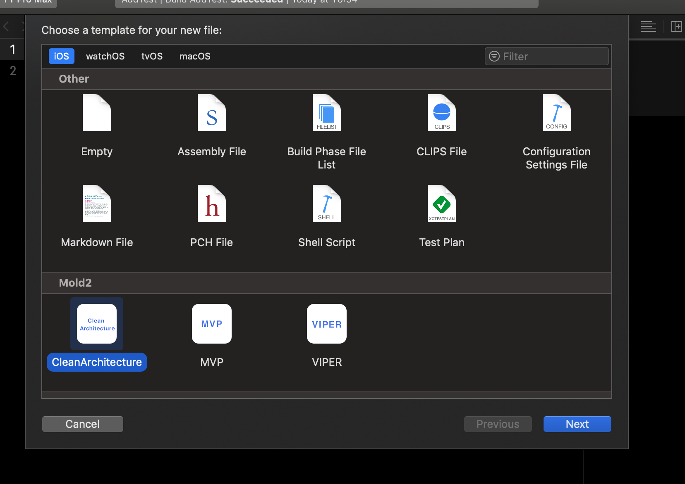

# Mold2
Mold2 installs ready-to-use templates in Xcode.  It includes templates for MVP, VIPER and CleanArchitecture. 

Mold2 is a rewrite of [suyati/Mold](https://github.com/suyati/Mold) to make it easier to use in my project.

## Installation
1. Download the files from this repository.
2. Open Termial
3. Navigate to the downloaded folder
4. Run the following script
5. That's it :) 🍻

```shell
swift boot.swift
```

## Usage
 
After installing you can access the templates from File -> New -> File. 

Scroll to the bottom and you can see a section named Mold2.



## Notice
The file templates generated for VIPER and CleanArchitecture require the use of the [Swinject/SwinjectStoryboard](https://github.com/Swinject/SwinjectStoryboard) as a DI container.

For more information about Swinject/SwinjectStoryboard, please check the documentation or the sample code to use.